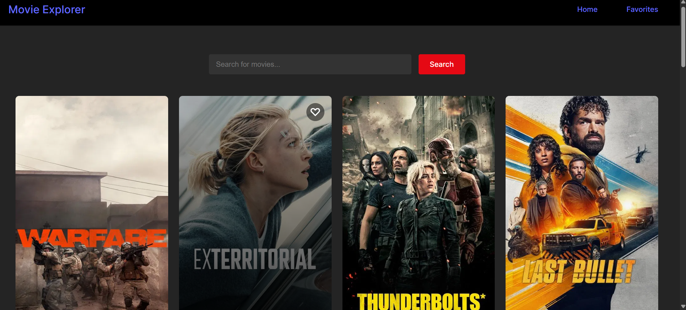
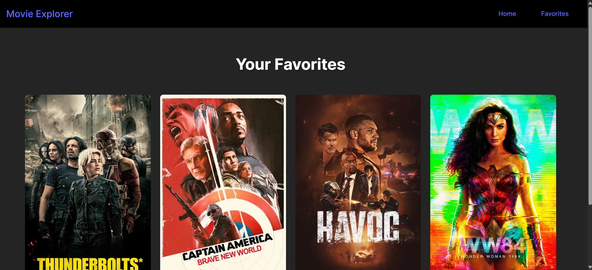

# Movie Explorer

**Movie Explorer** is a React-based web application that lets you explore movies, search for your favorite films, and add them to a favorites list. Built with the TMDB API, this app provides features like browsing popular movies, searching by title, and managing a personal collection of favorite movies.

## Features

- 🔍 **Search for Movies**: Easily search for movies by title.
- ❤️ **Favorites Management**: Add or remove movies to/from your favorites list.
- 🌟 **Popular Movies**: View a list of popular movies on the homepage, fetched from the TMDB API.
- ⚡ **State Management**: Uses React Context for managing the favorites list globally across the app.
- 💾 **Persistent Favorites**: Your favorite movies are stored in local storage, so they persist even when the app is reloaded.

## Technologies Used

- **React.js**: The frontend framework used to build the user interface.
- **TMDB API**: To fetch movie data (popular and search-based).
- **React Router**: For navigation between different pages (Home and Favorites).
- **React Context**: For managing global state, like the favorites list.
- **CSS**: For styling the application.

## Installation

To run this project locally, follow these steps:

1. Clone the repository:
    ```bash
    git clone https://github.com/lokeshgehlot/movie-explorer.git
    cd movie-explorer
    ```

2. Install the required dependencies:
    ```bash
    npm install
    ```

3. Start the development server:
    ```bash
    npm start
    ```

4. Open your browser and visit [http://localhost:3000](http://localhost:3000) to view the app.

## How to Use

- **Home Page**: Displays a grid of popular movies fetched from the TMDB API. You can search for movies by typing the title in the search bar.
- **Favorites Page**: View your saved favorite movies. You can add a movie to your favorites by clicking the heart icon on any movie in the grid, or remove it by clicking the same icon in the Favorites section.

## Screenshots


*Image showing the home page with a list of popular movies*


*Image showing the favorites page with saved movies*

## Contributing

1. Fork the repository.
2. Create your branch:  
   `git checkout -b feature/your-feature`
3. Commit your changes:  
   `git commit -m 'Add new feature'`
4. Push to the branch:  
   `git push origin feature/your-feature`
5. Create a new Pull Request.

## License

This project is licensed under the MIT License - see the LICENSE file for details.
